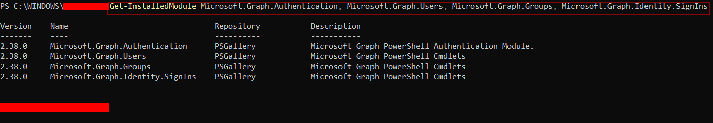
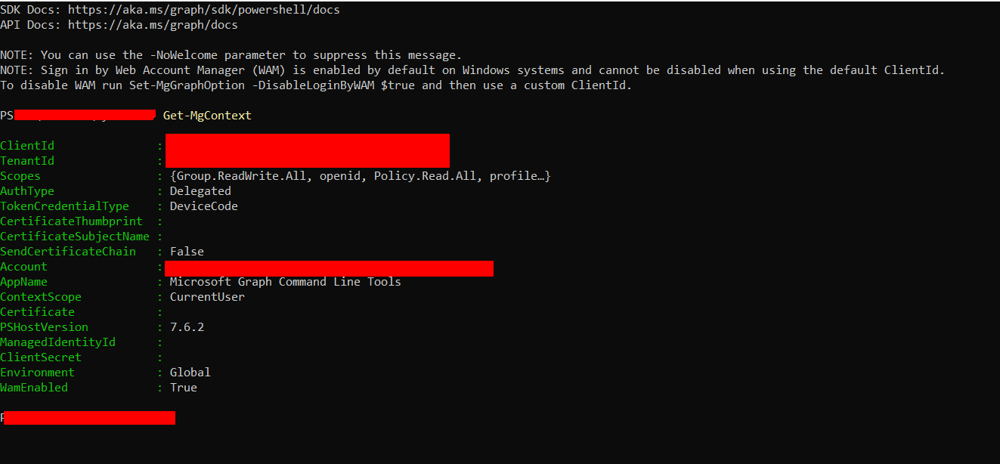
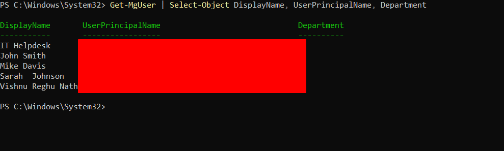
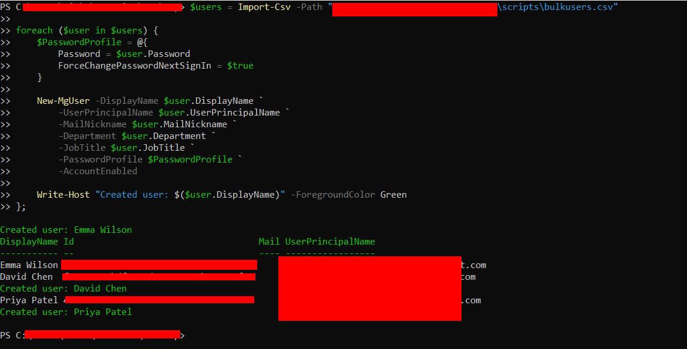
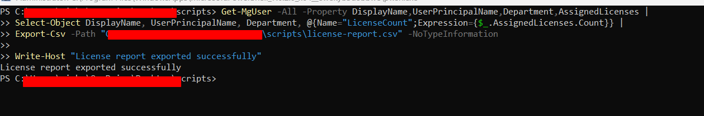
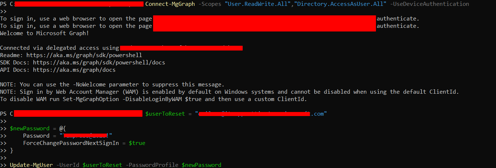
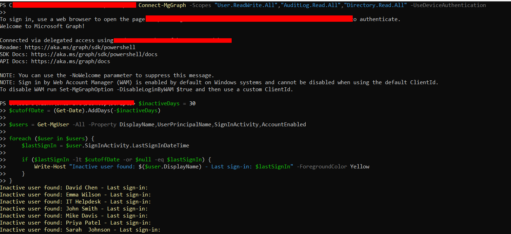
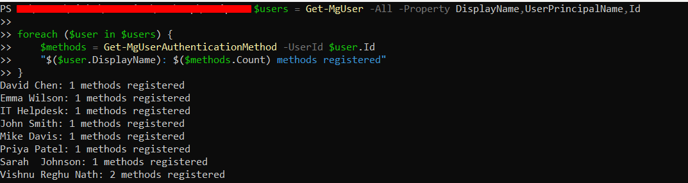

# PowerShell Automation for Microsoft 365

## Overview
Built a set of PowerShell automation scripts 
using the Microsoft Graph SDK to manage a live 
Microsoft 365 Business Premium tenant. Scripts 
cover bulk user provisioning, license reporting, 
password resets, inactive account detection, 
and MFA status auditing ,automating tasks that 
would otherwise require manual work in the 
Admin Center.

## Environment
- Microsoft 365 Business Premium
- PowerShell 7
- Microsoft Graph PowerShell SDK

## Scripts

### 01 — Bulk Create Users
Reads a CSV file of new hires and provisions 
each account automatically with department, 
job title, and a temporary password requiring 
change on first login.

### 02 — License Report
Pulls every user in the tenant along with their 
assigned license count and exports the results 
to CSV.

### 03 — Password Reset
Resets a specified user's password and enforces 
a mandatory change on next login, automating 
the most common helpdesk ticket type.

### 04 — Inactive User Detection
Queries sign in activity for all users and 
flags accounts that haven't signed in within 
30 days, or have never signed in.

### 05 — MFA Status Report
Checks registered authentication methods for 
every user, reporting how many MFA methods 
each account has configured.

## Key Learnings
- Microsoft Graph PowerShell replaced the 
  legacy MSOnline and AzureAD modules,
  installing only required sub-modules avoids 
  unnecessary overhead
- Different Graph operations require different 
  permission scopes — password resets need 
  Directory.AccessAsUser.All, sign-in activity 
  needs AuditLog.Read.All, separate from basic 
  user read/write access
- Object Id is required (not just UPN or display 
  name) for certain Graph queries like 
  authentication methods

## Technologies Used
Microsoft 365 Business Premium · Microsoft Graph 
PowerShell SDK · PowerShell 7

## Skills Demonstrated
- PowerShell scripting and automation
- Microsoft Graph API integration
- Bulk user provisioning from CSV
- License usage reporting
- Scripted password reset workflows
- Inactive account detection and security hygiene
- MFA registration auditing
- Troubleshooting authentication and permission 
  scope errors

  ## Screenshots

### Microsoft Graph Modules Installed

### Connected to Microsoft 365 Tenant

### Current Users Listed

### Bulk Users Created via Script

### License Report Generated

### Password Reset via Script

### Inactive Users Detected

### MFA Status Report

